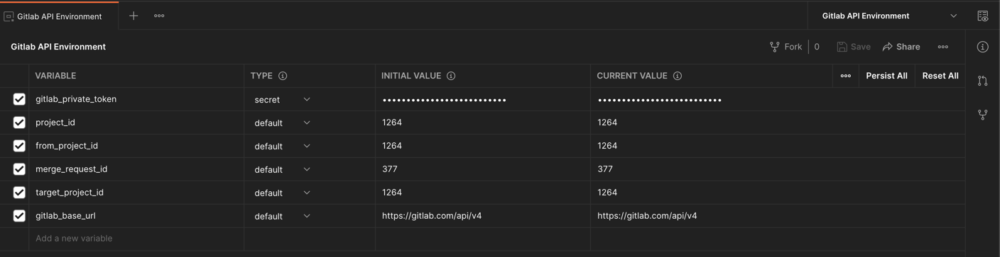

## Getting Started

`gitLab-service` provides to do bulk Gitlab operations.

### Prerequisites

- Java 21 should be installed and used. `export JAVA_HOME=$(/usr/libexec/java_home -v 21)`
- Maven should be installed.
- Docker can be installed (OPTIONAL).
- Postman can be installed (OPTIONAL).

### How to Run and Test Application

* `git clone https://github.com/musabbozkurt/gitlab-service.git`
* Open `application.yml` and replace `url, private-token, path-with-namespace`, and `max-number-of-project` with your
  values
* Run `mvn spring-boot:run` command in the project directory to run application
* Swagger: http://localhost:8080/swagger-ui.html

### How to Run and Test Application via Postman (OPTIONAL)

* [How to Import Postman Collection (OPTIONAL)](https://learning.postman.com/docs/getting-started/importing-and-exporting-data/)
    * Import `Gitlab_API_Postman_Collection.json`
    * Import `Gitlab_API_Environment_Postman_Environment.json`
    * Replace the followings with your values after the import is completed
        * 

### How to Run and Test Application via Docker (OPTIONAL)

* [How to Install and Run Docker Image (OPTIONAL)](https://spring.io/guides/topicals/spring-boot-docker/)
    * [Download and Install Docker](https://docs.docker.com/get-docker/)
    * Run the following commands in the DockerFile path to run the Spring Boot Project:
        * `mvn clean install`
        * `docker build -t mb/gitlab-service .`
        * `docker run -p 8080:8080 --name gitlab-service mb/gitlab-service`
        * [Swagger URL](http://localhost:8080/swagger-ui.html) to test APIs

### Reference Documentation

For further reference, please consider the following sections:

* https://docs.gitlab.com/ee/api/repositories.html#get-a-blob-from-repository
* https://stackoverflow.com/a/59006042
* https://docs.gitlab.com/ee/development/documentation/restful_api_styleguide.html
* https://docs.gitlab.com/ee/api/merge_requests.html